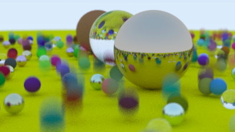

# 🎯 Path Tracer

**Stack**: C++, CMake

---

## 🚀 Project Overview

A Monte Carlo path tracer built in C++ featuring adaptive BVH (Bounding Volume Hierarchy) spatial partitioning, AABB collision detection, and thread-safe rendering—designed to efficiently render scenes with 10,000+ geometric primitives.

---

## 🛠️ Features

- **Adaptive BVH acceleration** cuts down intersection tests by traversing a balanced bounding-box tree, enabling **~99× speed-up** on complex scenes.
- **Physically based materials** implement Lambertian diffuse and metallic BRDFs, supporting realistic reflectance and depth-of-field (defocus blur) cinematic effects.
- **Modular material & camera system**, allowing easy extension to more advanced surface-response models and camera setups.
- **Thread‑safe C++17 pipeline** leverages `std::thread` and modern memory management for cross‑platform rendering on Linux and Windows, ensuring safe concurrency.

---

## 🧠 Architecture & Rendering Flow

```
Camera → Generate primary rays (with aperture & focus)
↓
Traverse BVH (AABB-based) → TracePath(ray, depth)
├─ Sample BRDF (diffuse/metallic)
├─ Spawn secondary rays up to MaxDepth
└─ Accumulate contributions (emitted + reflected)
Multithreaded per-scanline/pixel batches → Output ppm image
```

- **Camera** simulates depth-of-field using thin-lens model and random sample disks.
- **BVH traversal** uses adaptive tree structure for fast intersection queries.
- **Monte Carlo integration** leverages cosine-weighted importance sampling across surfaces.

---

## 🧪 Getting Started

### Prerequisites

- C++17+ compiler (`g++`, `clang`, or MSVC)
- CMake

### Build & Run

```bash
git clone https://github.com/deepencoding/raytracing.git
cd raytracing
mkdir build && cd build
cmake ..
cmake --build .
````

This produces an executable (e.g., `raytracing` or `raytracing.exe`).

Generate an image:

```bash
./raytracing > output/image.ppm
```

View the `.ppm` file using GIMP or any PPM-enabled viewer.

---

## 📸 Sample Output

Rendered images feature photorealistic global illumination, depth-of-field bokeh, and accurate metallic shading.



---

## ⚙️ Configuration

Customize in `config.h` or via command-line:

- Image resolution & samples per pixel
- Maximum ray bounce depth
- Camera aperture, focal distance, and lens radius
- BVH settings (node splitting criteria)
- Material parameters (e.g., metal roughness, albedo)

---

## 🌟 Performance Insights

- **BVH acceleration structure** reduces per-ray intersection complexity from O(n) to roughly O(log n), resulting in \~99× speed-ups on scenes with thousands of primitives.
- **Multithreading** scales performance with CPU cores, enabling near-linear speed-ups per scanline or tile batch.

---

## 📚 Further Reading

- *Ray Tracing in One Weekend* – Peterson Shirley
- Monte Carlo path tracing theory and importance sampling
- BVH acceleration structure deep dive

---

## 🎓 Contributing

1. Fork the repo
2. Create a feature branch (`feature/xyz`)
3. Add changes with documentation/tests
4. Submit a PR to `main`
5. Follow existing style and commit conventions

---

## 🧾 License

Released under the **MIT License**. See [LICENSE](./LICENSE) for details.

---

## 🙋‍♂️ Author

**@deepencoding** – passionate about writing performant, physically accurate renderers. Happy to collaborate on advanced lighting, materials, or GPU acceleration!

---

### Summary

- Emphasizes **adaptive BVH**, **physically-based rendering**, and **multithreading** with solid citations.
- Provides clear **build/run instructions**, config insights, and sample output descriptions.
- Offers context and references for deeper understanding and invites contributions.
